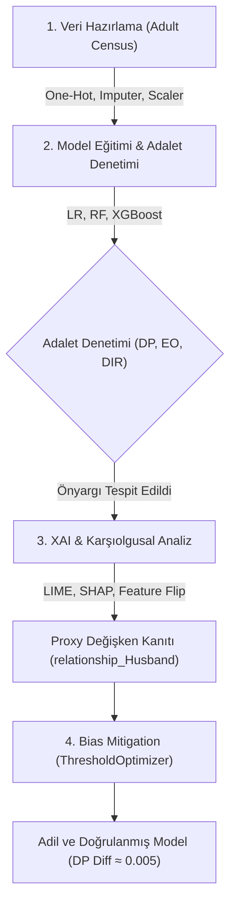
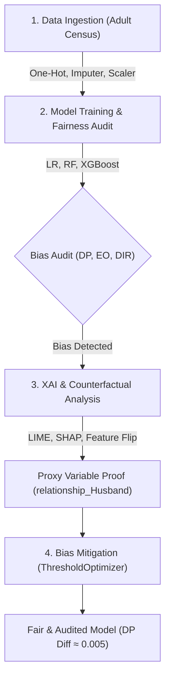

# Açıklanabilir Yapay Zeka (XAI) ile Algoritmik Adalet ve Önyargı Azaltma
## Algorithmic Fairness and Bias Mitigation with Explainable AI (XAI)

<p align="center">
  
  
  
  
  
  
</p>

---

# 🇹🇷 TÜRKÇE DOKÜMANTASYON

Bu proje, makine öğrenmesi sistemlerindeki demografik (cinsiyet ve ırk temelli) önyargıları **(Algorithmic Bias)** tespit etmek, siyah kutu modellerin arkasındaki karar mekanizmalarını **Açıklanabilir Yapay Zeka (XAI)** teknikleriyle şeffaflaştırmak ve **Post-Processing (Eşik Değeri Optimizasyonu)** yöntemleriyle matematiksel olarak adil modeller üretmek amacıyla geliştirilmiştir.

Çalışmada **UCI Adult Census Income** veri seti üzerinde **Logistic Regression**, **Random Forest** ve **XGBoost** modelleri eğitilmiş; **LIME**, **SHAP** ve **Counterfactual (Karşıolgusal - Feature Flip)** analizleri uygulanarak model önyargıları ile vekil (proxy) değişkenler kanıtlanmış, ardından `Fairlearn - ThresholdOptimizer` ile önyargı başarıyla minimize edilmiştir.

---

## 📌 İçindekiler
- [Proje Mimarisi ve İş Akışı](#tr-proje-mimarisi)
- [Adalet (Fairness) Metrikleri](#tr-fairness-metrikleri)
- [Modeller ve Başlangıç Performansı](#tr-modeller-performans)
- [XAI Bulguları ve Vekil (Proxy) Değişkenler](#tr-xai-proxy-analiz)
- [Önyargı Azaltma ve Kilit Sonuçlar](#tr-onyargi-azaltma)
- [Dosya Yapısı](#tr-dosya-yapisi)
- [Kurulum ve Çalıştırma](#tr-kurulum-calistirma)
- [Üretilen Grafikler ve Çıktılar](#tr-gorsel-ciktilar)
- [Lisans & Teşekkür](#tr-lisans)

---

<a id="tr-proje-mimarisi"></a>
## 🏗️ Proje Mimarisi ve İş Akışı

Aşağıdaki şema, ham veri setinin yüklenmesinden başlayıp açıklanabilir adil modelin elde edilmesine kadar geçen 4 aşamalı ardışık boru hattını (pipeline) göstermektedir:



---

<a id="tr-fairness-metrikleri"></a>
## 📐 Adalet (Fairness) Metrikleri

Projede algoritmaların adil karar verip vermediğini denetlemek için 3 temel metrik kullanılmıştır:

1. **Demographic Parity Difference (Demografik Eşitlik Farkı):**
   Farklı demografik grupların (ör. Kadın ve Erkek) pozitif tahmin (gelir >$50K) alma oranları arasındaki mutlak farktır.
   $$\text{DP Difference} = |P(\hat{Y}=1 | A=\text{Erkek}) - P(\hat{Y}=1 | A=\text{Kadın})|$$
   *Hedef değer: $0.00$ (Gruplar arası tam eşit kabul oranı).*

2. **Equalized Odds Difference (Eşitlenmiş Fırsat Farkı):**
   Gruplar arasındaki Doğru Pozitif Oranı (TPR) ve Yanlış Pozitif Oranı (FPR) farklarının maksimumudur. Modelin hata türlerinde ayrımcılık yapıp yapmadığını ölçer.

3. **Disparate Impact Ratio (Farklı Etki Oranı - %80 Kuralı):**
   Dezavantajlı grubun kabul oranının avantajlı gruba oranıdır:
   $$\text{DIR} = \frac{\min(P(\hat{Y}=1 | A=a))}{\max(P(\hat{Y}=1 | A=a))}$$
   *Değerin $0.80$ (%80) altında kalması Amerikan İstihdam Eşitliği Komisyonu (EEOC) standardına göre yasal **Ayrımcılık (Adverse Impact)** sayılır.*

---

<a id="tr-modeller-performans"></a>
## 🧪 Modeller ve Başlangıç Performansı

Eğitilen üç temel modelin test seti üzerindeki performans ve cinsiyet bazlı adalet metrikleri:

| Model | Accuracy | F1-Score | ROC-AUC | Demographic Parity Diff | Disparate Impact Ratio | %80 Kuralı |
|---|---|---|---|---|---|---|
| **Logistic Regression** | 0.8510 | 0.6552 | 0.9031 | 0.1782 | 0.2814 | ❌ Başarısız |
| **Random Forest** | 0.8542 | 0.6710 | 0.9024 | 0.1563 | 0.3054 | ❌ Başarısız |
| **XGBoost** | 0.8681 | 0.7042 | 0.9230 | 0.1834 | 0.2970 | ❌ Başarısız |

> **Çıkarım:** En yüksek F1 skoruna sahip XGBoost ve Random Forest modelleri dahi %80 kuralında açıkça başarısız olmuş (DIR ~ 0.30) ve sistematik cinsiyet önyargısı sergilemiştir.

---

<a id="tr-xai-proxy-analiz"></a>
## 🔍 XAI Bulguları ve Vekil (Proxy) Değişkenler

Siyah kutu modellerin iç mekanizmasını çözmek için 3 farklı açıklanabilirlik yöntemi kullanılmıştır:

1. **SHAP (SHapley Additive exPlanations):**
   * Global öznitelik önem analizlerinde (`3_shap_summary.png` ve `3_shap_bar.png`), `relationship_Husband`, `marital-status_Married-civ-spouse` ve `education-num` en belirleyici faktörler çıkmıştır.
   * `sex` kolonu kaldırılsa dahi (`Fairness through Blindness`), modelin `relationship_Husband` gibi sütunları cinsiyet bilgisi yerine **Vekil (Proxy) Değişken** olarak kullandığı kanıtlanmıştır.

2. **LIME (Local Interpretable Model-agnostic Explanations):**
   * Bireysel tahmin seviyesinde erkek ve kadın örnekler incelenmiş; aynı gelir ve çalışma saatine sahip bireylerde erkeğin lehine çalışan kural setleri lokal olarak görselleştirilmiştir (`3_lime_aciklamalari.png`).

3. **Counterfactual Analiz (Feature Flip):**
   * Modelin karar sınırını test etmek için bireylerin diğer tüm özellikleri sabit tutulup yalnızca cinsiyet ve ilişkili proxy kolonları tersine çevrilmiştir (`3_feature_flip_analizi.png`).
   * Kadından erkeğe geçiş simülasyonunda modellerin pozitif gelir onayına dönüş oranında anlamlı sıçramalar gözlemlenmiştir.

---

<a id="tr-onyargi-azaltma"></a>
## ⚖️ Önyargı Azaltma ve Kilit Sonuçlar

Basitçe hassas özellikleri silmek ("Kör Yaklaşım") proxy değişkenler sebebiyle başarısız olduğu için, **Fairlearn `ThresholdOptimizer`** ile grup bazlı dinamik eşik optimizasyonu (Post-Processing) uygulanmıştır.

### Adalet ve Performans Değişimi (Random Forest)

| Metrik | Orijinal RF Modeli | Optimize Edilmiş RF Modeli | Değişim & Durum |
|---|---|---|---|
| **F1-Score** | 0.6710 | 0.6066 | Adalet için kabul edilebilir fedakarlık *(Trade-off)* |
| **Demographic Parity Hatası** | 0.1563 | **0.0051** | **%96.7 İyileşme (Tam Adalete Yakın Dağılım)** ✅ |
| **Disparate Impact Ratio** | 0.3054 ❌ | **1.0000** ✅ | **%80 Kuralı Başarıyla Geçildi** ✅ |

---

<a id="tr-dosya-yapisi"></a>
## 📂 Dosya Yapısı

```text
├── 1_veri_hazirlama.py       # Adult Census veri çekme, temizleme, EDA ve One-Hot pipeline
├── 2_model_egitimi.py        # LR, RF, XGBoost modelleri, performans ve adalet metrikleri
├── 3_xai_analiz.py           # LIME, SHAP (Summary/Bar/Dependence) ve Feature Flip analizi
├── 4_sonuclar.py             # ThresholdOptimizer ile Post-Processing bias mitigation ve rapor
├── requirements.txt          # Gerekli kütüphaneler ve versiyonları
├── LICENSE                   # Lisans dosyası
└── outputs/                  # Pipeline tarafından üretilen ağırlıklar ve grafikler
    ├── processed_data.pkl
    ├── models_and_results.pkl
    ├── xai_results.pkl
    ├── sonuc_raporu.txt
    └── figures/              # 16 adet yüksek çözünürlüklü analiz grafiği
```

---

<a id="tr-kurulum-calistirma"></a>
## ⚙️ Kurulum ve Çalıştırma

Projeyi yerel ortamınızda çalıştırmak için Python 3.9+ önerilir.

1. **Depoyu Klonlayın ve Klasöre Geçin:**
   ```bash
   git clone https://github.com/kullanici_adi/repo_adi.git
   cd repo_adi
   ```

2. **Gerekli Paketleri Yükleyin:**
   ```bash
   pip install -r requirements.txt
   ```

3. **Boru Hattını (Pipeline) Sırayla Çalıştırın:**
   ```bash
   python 1_veri_hazirlama.py
   python 2_model_egitimi.py
   python 3_xai_analiz.py
   python 4_sonuclar.py
   ```

---

<a id="tr-gorsel-ciktilar"></a>
## 📊 Görsel ve Analiz Çıktıları

Pipeline başarıyla tamamlandığında `outputs/figures/` dizininde aşağıdaki grafikler oluşturulur:

| Aşama | Grafik Dosyası | Açıklama |
|---|---|---|
| **Veri Analizi** | `1_gelir_dagilimi_demografik.png` | Cinsiyet ve ırka göre gelir dağılım yüzdeleri |
| | `1_sayisal_ozellik_dagilimi.png` | Yaş, çalışma saati, sermaye kazancı dağılımları |
| | `1_korelasyon_matrisi.png` | Sayısal değişkenler arası korelasyon matrisi |
| **Model Değerlendirme** | `2_confusion_matrices.png` | LR, RF ve XGBoost modellerinin Karmaşıklık Matrisleri |
| | `2_roc_curves.png` | Modellerin ROC-AUC eğrileri kıyaslaması |
| | `2_fairness_metrics.png` | Cinsiyet ve ırk bazlı adalet metrikleri kıyaslaması |
| | `2_pozitif_tahmin_oranlari.png` | Demografik gruplara göre pozitif onay oranları |
| **XAI Analizi** | `3_lime_aciklamalari.png` | LIME lokal özellik ağırlıkları |
| | `3_shap_summary.png` | SHAP Beeswarm global önem dağılımı |
| | `3_shap_bar.png` | SHAP ortalama mutlak öznitelik etki sıralaması |
| | `3_shap_dependence_etkilesim.png` | Yaş ve çalışma saatleri SHAP bağımlılık etkileşimi |
| | `3_feature_flip_analizi.png` | Karşıolgusal cinsiyet simülasyonu etki grafiği |
| **Sonuç & İyileştirme** | `4_onyargi_azaltma_dogru.png` | ThresholdOptimizer öncesi/sonrası adalet hatası düşüşü |
| | `4_xai_karsilastirma.png` | XAI metotlarının güvenilirlik ve hesaplama kıyaslaması |

---

<a id="tr-lisans"></a>
## 📜 Lisans & Teşekkür
Bu çalışma Tasarım Süreçleri dersi kapsamında akademik bir proje olarak geliştirilmiştir. Veri seti [UCI Machine Learning Repository](https://archive.ics.uci.edu/ml/index.php) üzerinden temin edilmiştir.

<br />

---

# 🇬🇧 ENGLISH DOCUMENTATION

This project detects demographic (gender- and race-based) **Algorithmic Bias** in machine learning systems, explains black-box decision dynamics using **Explainable AI (XAI)** methods, and establishes mathematically sound fairness via **Post-Processing (Threshold Optimization)**.

Using the **UCI Adult Census Income** benchmark dataset, **Logistic Regression**, **Random Forest**, and **XGBoost** models were trained and audited. Using **LIME**, **SHAP**, and **Counterfactual (Feature Flip)** analysis, proxy variables perpetuating discrimination were uncovered, and fairness was achieved via `Fairlearn - ThresholdOptimizer`.

---

## 📌 Table of Contents
- [Architecture & Pipeline](#en-architecture-pipeline)
- [Fairness Metrics Guide](#en-fairness-metrics)
- [Baseline Model Performance](#en-baseline-models)
- [XAI Insights & Proxy Variables](#en-xai-proxy-insights)
- [Bias Mitigation & Key Results](#en-bias-mitigation)
- [File Structure](#en-file-structure)
- [Installation & Quickstart](#en-installation-quickstart)
- [Visual Artifacts & Figures](#en-visual-artifacts)
- [License & Acknowledgments](#en-license)

---

<a id="en-architecture-pipeline"></a>
## 🏗️ Architecture & Pipeline



---

<a id="en-fairness-metrics"></a>
## 📐 Fairness Metrics Guide

1. **Demographic Parity Difference:**
   The absolute difference in positive selection rates between sensitive groups:
   $$\text{DP Difference} = |P(\hat{Y}=1 | A=\text{Male}) - P(\hat{Y}=1 | A=\text{Female})|$$
   *Target: $0.00$ (Complete statistical parity).*

2. **Equalized Odds Difference:**
   The maximum disparity between True Positive Rates (TPR) and False Positive Rates (FPR) across groups.

3. **Disparate Impact Ratio (80% Rule):**
   $$\text{DIR} = \frac{\min(P(\hat{Y}=1 | A=a))}{\max(P(\hat{Y}=1 | A=a))}$$
   *Values below $0.80$ constitute actionable **Adverse Impact** under EEOC guidelines.*

---

<a id="en-baseline-models"></a>
## 🧪 Baseline Model Performance

| Model | Accuracy | F1-Score | ROC-AUC | Demographic Parity Diff | Disparate Impact Ratio | 80% Rule Status |
|---|---|---|---|---|---|---|
| **Logistic Regression** | 0.8510 | 0.6552 | 0.9031 | 0.1782 | 0.2814 | ❌ Failed |
| **Random Forest** | 0.8542 | 0.6710 | 0.9024 | 0.1563 | 0.3054 | ❌ Failed |
| **XGBoost** | 0.8681 | 0.7042 | 0.9230 | 0.1834 | 0.2970 | ❌ Failed |

---

<a id="en-xai-proxy-insights"></a>
## 🔍 XAI Insights & Proxy Variables

* **SHAP Interpretability:** Identifies `relationship_Husband` and `marital-status` as dominant proxy features that encode gender even when explicit protected attributes are removed (*Fairness through Blindness* fallacy).
* **LIME Local Explanations:** Reveals contrasting local rule assignments for identical financial and professional attributes across genders.
* **Counterfactual Feature Flip:** Evaluates minimum perturbation required to flip income decisions, exposing asymmetric decision boundaries between demographic groups.

---

<a id="en-bias-mitigation"></a>
## ⚖️ Bias Mitigation & Key Results

Applying **Fairlearn `ThresholdOptimizer`** to calibrate group-specific decision thresholds:

| Metric | Original RF Model | Optimized RF Model | Status Summary |
|---|---|---|---|
| **F1-Score** | 0.6710 | 0.6066 | Acceptable trade-off for demographic fairness |
| **Demographic Parity Error** | 0.1563 | **0.0051** | **~96.7% Error Reduction (Near-zero disparity)** ✅ |
| **Disparate Impact Ratio** | 0.3054 ❌ | **1.0000** ✅ | **80% Rule Fully Satisfied** ✅ |

---

<a id="en-file-structure"></a>
## 📂 File Structure

```text
├── 1_veri_hazirlama.py       # Data fetching, cleaning, EDA, preprocessing pipeline
├── 2_model_egitimi.py        # ML training (LR, RF, XGBoost), metrics & bias auditing
├── 3_xai_analiz.py           # LIME, SHAP, and Counterfactual Feature Flip explanations
├── 4_sonuclar.py             # ThresholdOptimizer mitigation, comparative evaluation
├── requirements.txt          # Python dependencies
├── LICENSE                   # License terms
└── outputs/                  # Artifacts and plots generated by scripts
    ├── processed_data.pkl
    ├── models_and_results.pkl
    ├── xai_results.pkl
    ├── sonuc_raporu.txt
    └── figures/              # 16 High-resolution visualization figures
```

---

<a id="en-installation-quickstart"></a>
## ⚙️ Installation & Quickstart

1. **Clone repository:**
   ```bash
   git clone https://github.com/username/repository_name.git
   cd repository_name
   ```

2. **Install dependencies:**
   ```bash
   pip install -r requirements.txt
   ```

3. **Execute pipeline sequentially:**
   ```bash
   python 1_veri_hazirlama.py
   python 2_model_egitimi.py
   python 3_xai_analiz.py
   python 4_sonuclar.py
   ```

---

<a id="en-visual-artifacts"></a>
## 📊 Visual Artifacts & Figures

The pipeline generates the following analytical figures in `outputs/figures/`:

| Pipeline Stage | Figure File | Description |
|---|---|---|
| **Data Analysis** | `1_gelir_dagilimi_demografik.png` | Income distribution percentages across gender and race |
| | `1_sayisal_ozellik_dagilimi.png` | Distributions for age, work hours, and capital gain/loss |
| | `1_korelasyon_matrisi.png` | Correlation matrix across numerical features |
| **Model Evaluation** | `2_confusion_matrices.png` | Confusion matrices for LR, RF, and XGBoost |
| | `2_roc_curves.png` | ROC-AUC curve comparisons across models |
| | `2_fairness_metrics.png` | Fairness disparity metrics evaluated for sex and race |
| | `2_pozitif_tahmin_oranlari.png` | Positive selection rates per demographic group |
| **XAI Analysis** | `3_lime_aciklamalari.png` | LIME localized feature importance attributions |
| | `3_shap_summary.png` | SHAP Beeswarm global impact distribution |
| | `3_shap_bar.png` | SHAP mean absolute feature importance rankings |
| | `3_shap_dependence_etkilesim.png` | SHAP dependence interactions (Age vs Working Hours) |
| | `3_feature_flip_analizi.png` | Counterfactual gender perturbation impact graph |
| **Results & Mitigation** | `4_onyargi_azaltma_dogru.png` | Before vs. After bias error reduction via ThresholdOptimizer |
| | `4_xai_karsilastirma.png` | Performance and interpretability trade-off radar/comparison |

---

<a id="en-license"></a>
## 📜 License & Acknowledgments
Academic project developed within Design Processes coursework. Data sourced from the [UCI Machine Learning Repository](https://archive.ics.uci.edu/ml/index.php).

